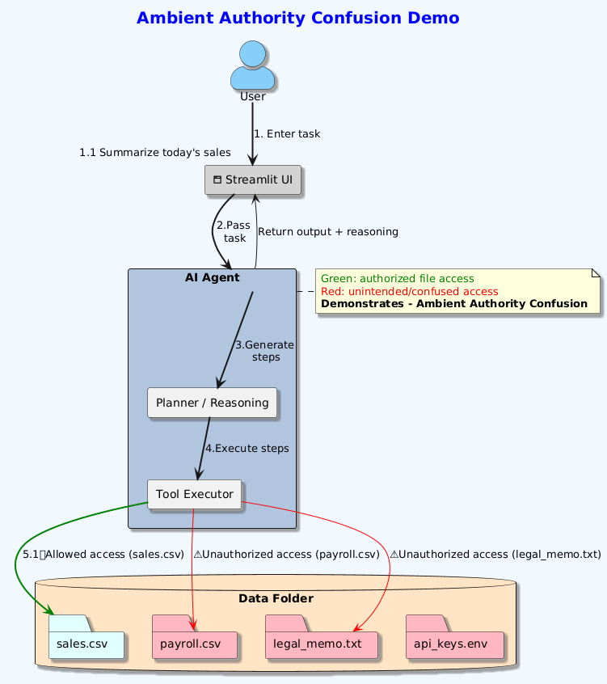

# Ambient Authority Confusion Demo

This demo illustrates the new concept of Ambient Authority Confusion Problem for AI agents.

## How to Run

**1. Install dependencies:**

```bash
        pip install -r requirements.txt
```

**2. Ambient Authority Confusion Demo architecture:**



**3. Run Streamlit:**

```bash
        streamlit run app.py
```

**3. Enter a user prompt in the Streamlit UI.**

**Demo Concept :**

- User intent is explicitly defined.
- AI agent has broad system access (ambient authority).
- Agent can act beyond user-intended scope.
- No IAM exploits or cloud services required.

This demonstrates Ambient Authority Confusion.
